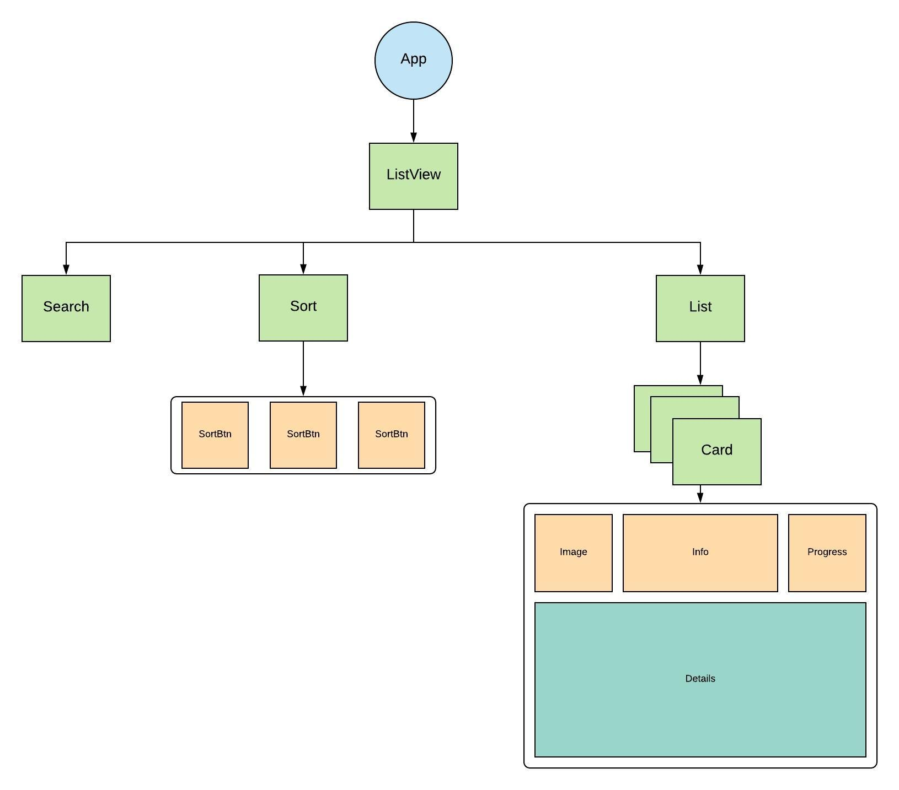
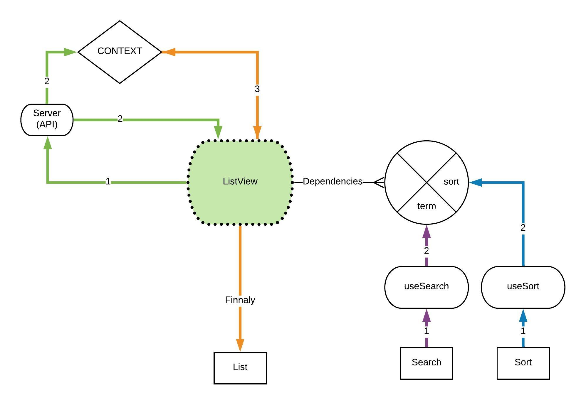

## REEL task - Grid List

<a href='https://grid-list.olegakan5326.now.sh'>LIVE DEMO</a>

### Structure

#### Components stucture


#### Data flow


#####<span style='background: rgba(0,100,0,.4)'><strong>First render</strong></span>
1. List view fetches data from mock API server
2. API reponse updates ListView local and global (context) data stores
3. <span style='background: rgba(200,100,0,.4)'>Finnaly</span> ListView maps it's local state and renders Cards

#####<span style='background: rgba(100,0,200,.4)'><strong>Search handling</strong></span>
`useSearch` hook observes `onChange` event of `Search` (user typing). Once typing is done, filters global store based on typed search term and updates `ListView` local data store with .6s delay (resets on every key press, delay value passed by argument to `useInput` in `Search`)
 
<span style='background: rgba(0,100,255,.4)'><strong>Sort handling</strong></span>
`useSort` hook observes changes of `sortType` in global store (context). In `Sort`, `SortButton` `onClick` event changes global `sortType` value, which triggers resort of `ListView` local store. Default sort value = `undefined`. Double click on the same `sortType` changes order descending (`orderDSC=true`) => ascending(`orderDSC=false`)

#### Folders structure
```
src
  |____ components
  |   |____SomeComponent
  |       |____css
  |           |____ styles.module.scss
  |           |____ styles.module.css
  |       |____ tests
  |       |____ components
  |           |____ SomeSubComponent.js
  |       |____ SomeComponent.js
  |____ context
  |   |____ ContextFile.js
  |____ hooks
  |   |____ useCustomHook.js
  |____ testUtils
  |   |____ someMock.js
  |____ utils
      |____ someUtil.js

```
##### jsconfig.json for Absolute path
```
{
  "compilerOptions": {
    "baseUrl": "src"
  },
  "include": ["src"]
}
```

#### Dev dependancies
```
  "@testing-library/react": "^8.0.5",
  "@types/jest": "^24.0.15",
  "enzyme": "^3.10.0",
  "enzyme-adapter-react-16": "^1.14.0",
  "enzyme-to-json": "^3.3.5"
```
SASS compiler for VSCode
https://github.com/ritwickdey/vscode-live-sass-compiler

### Responsive layout

Achieved using combination of `css-grid`
```
grid-template-columns: repeat(auto-fit, minmax(300px, 1fr));
```
and `@media` breakpoints changing bodyPadding css variable
```
@media (min-width: 500px) {
  :root {
    --bodyPadding: 2rem 2rem;
  }
}
```

### TODOs if I had more time

More tests<br/>
CSS animations<br/>
Decompose Card.module.scss<br/>
Add Filter to filter list items<br/>
